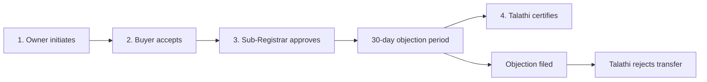

# Blockchain 7/12 Land Record System

This project is a local blockchain demonstration of a Maharashtra 7/12 land-record and ownership-mutation system. It combines a Solidity smart contract, a Hardhat development chain, a React/Vite frontend, MetaMask, client-side document encryption, and Pinata/IPFS uploads.

The application supports these users:

- **Citizen/landowner:** views owned land and starts a transfer.
- **Buyer:** accepts a transfer addressed to their wallet.
- **Sub-Registrar:** approves an accepted sale deed and starts the objection period.
- **Talathi:** registers land, handles objections, and certifies mutation after the objection period.
- **Bank:** records or clears a mortgage that can block a transfer.
- **Public user:** searches for and verifies a 7/12 extract without connecting a wallet.

## Technology

- Solidity 0.8.20 and OpenZeppelin AccessControl
- Hardhat local Ethereum network
- React 18, Vite, and Tailwind CSS
- ethers.js 6 and MetaMask
- AES-GCM browser encryption
- Pinata/IPFS for encrypted document storage

## Project structure

```text
Blockchain_Project/
├── contracts/
│   ├── contracts/LandRegistry.sol   Smart contract
│   ├── scripts/deploy.js             Deployment, roles, and demo data
│   └── test/LandRegistry.js          Contract test suite
├── frontend/
│   ├── src/contracts/                Exported contract address and ABI
│   ├── src/pages/                    Citizen and authority dashboards
│   └── src/utils/                    Encryption and Pinata helpers
├── ARCHITECTURE.md                   Technical design notes
└── PROJECT_REPORT_CONTENT.md         Tailored project-report material
```

## Prerequisites

Install the following before starting:

- [Node.js](https://nodejs.org/) 18 or newer
- npm
- [MetaMask](https://metamask.io/download/) browser extension
- A Pinata account and JWT if you want to register land or initiate a transfer

The public search and existing blockchain records can be viewed without Pinata. Document-upload actions require `VITE_PINATA_JWT`.

## Clone and install

```bash
git clone <repository-url>
cd Blockchain_Project
npm install
```

The root project uses npm workspaces, so one `npm install` installs the contract and frontend dependencies.

## Environment configuration

Create the frontend environment file from its template.

PowerShell:

```powershell
Copy-Item frontend/.env.example frontend/.env
```

Command Prompt, Git Bash, Linux, or macOS:

```bash
cp frontend/.env.example frontend/.env
```

Edit `frontend/.env`:

```env
VITE_PINATA_JWT=your_restricted_pinata_jwt
```

The JWT is used by browser code and is visible to the person running the frontend. Use a restricted development token. A production system should upload through a protected backend instead.

`contracts/.env` is not required for localhost. `contracts/.env.example` contains placeholders for future public-network configuration. Never commit either real `.env` file.

## Start the complete local project

Keep three terminals open. Run every command from the repository root.

### Terminal 1: start the blockchain

```bash
npm run node --workspace contracts
```

Leave this terminal running. Hardhat prints 20 development accounts and private keys.

### Terminal 2: deploy the contract

```bash
npm run deploy:local --workspace contracts
```

Deployment performs four tasks:

1. Deploys `LandRegistry` to `http://127.0.0.1:8545`.
2. Assigns the Talathi, Sub-Registrar, and Bank roles.
3. Registers five demonstration parcels owned by Account 0.
4. Writes the current address and ABI to `frontend/src/contracts/LandRegistry.json`.

Run deployment after the Hardhat node starts and whenever that node is restarted. A restarted local node has a new empty blockchain.

### Terminal 3: start the website

```bash
npm run dev --workspace frontend
```

Open [http://127.0.0.1:5173](http://127.0.0.1:5173).

## Configure MetaMask

Add a custom network:

| Setting | Value |
|---|---|
| Network name | Hardhat Localhost |
| RPC URL | `http://127.0.0.1:8545` |
| Chain ID | `31337` |
| Currency symbol | `ETH` |

Import a role account by selecting **Import account** in MetaMask and entering its private key. An address beginning with `0x` is not a private key; use the matching value from the final column below.

These are public Hardhat development credentials. Use them only on the local chain and never send real funds to them.

| Account | Application role | Address | Local private key |
|---|---|---|---|
| 0 | Admin, demo landowner | `0xf39Fd6e51aad88F6F4ce6aB8827279cffFb92266` | `0xac0974bec39a17e36ba4a6b4d238ff944bacb478cbed5efcae784d7bf4f2ff80` |
| 1 | Talathi | `0x70997970C51812dc3A010C7d01b50e0d17dc79C8` | `0x59c6995e998f97a5a0044966f0945389dc9e86dae88c7a8412f4603b6b78690d` |
| 2 | Sub-Registrar | `0x3C44CdDdB6a900fa2b585dd299e03d12FA4293BC` | `0x5de4111afa1a4b94908f83103eb1f1706367c2e68ca870fc3fb9a804cdab365a` |
| 3 | Bank | `0x90F79bf6EB2c4f870365E785982E1f101E93b906` | `0x7c852118294e51e653712a81e05800f419141751be58f605c371e15141b007a6` |
| 4 | Suggested buyer | `0x15d34AAf54267DB7D7c367839AAf71A00a2C6A65` | `0x47e179ec197488593b187f80a00eb0da91f1b9d0b13f8733639f19c30a34926a` |

Connect the website after selecting the desired MetaMask account. Switching accounts changes the active dashboard automatically.

## Seeded demonstration records

The deploy script creates these parcels for Account 0:

| Village | Survey/sub-number | Area | Type |
|---|---:|---:|---|
| Pune | 101/1 | 2,000 sq. m | Agricultural |
| Mumbai | 102/2 | 1,500 sq. m | Residential |
| Nagpur | 103/1 | 3,000 sq. m | Agricultural |
| Nashik | 104/5 | 1,200 sq. m | Non-agricultural |
| Thane | 105/1 | 2,500 sq. m | Residential |

Parcel IDs are generated from the exact village, survey number, and sub-number. Village spelling and capitalization therefore matter. The dashboards display the full ID and provide a copy button.

## Ownership mutation workflow



### Step 1: owner initiates

1. Select MetaMask Account 0 and connect the website.
2. Open **My Lands**.
3. Choose **Initiate Sale / Transfer** on a seeded parcel.
4. Enter Account 4 as the buyer.
5. Enter a sale price in Wei.
6. Select a sale-deed file and enter an encryption password.
7. Submit and confirm the MetaMask transaction.

The browser encrypts the document before uploading it to Pinata. Only the encrypted IPFS CID is stored on-chain.

### Step 2: buyer accepts

1. Switch MetaMask to Account 4.
2. Open **My Lands**.
3. The pending purchase appears automatically in **Accept a land transfer**.
4. Select **Accept Transfer** and confirm the transaction.

The website discovers the parcel automatically; the buyer does not need to paste its ID.

### Step 3: Sub-Registrar approves

1. Switch MetaMask to Account 2.
2. Open the **Sub-Registrar** dashboard.
3. Find the buyer-accepted transaction in the automatic queue.
4. Select **Approve Registration** and confirm it.

Approval starts the on-chain 30-day objection period. It does not immediately change ownership.

### Objections

During the 30-day period, a connected user can open **My Lands**, locate the registered transfer, enter an objection reason or document CID, and select **File Objection**.

An objected transfer cannot be certified. The Talathi sees it in the mutation queue and can reject the transfer with a reason.

### Step 4: Talathi certifies

For the localhost demonstration, waiting 30 real days is unnecessary:

1. Switch MetaMask to Account 1.
2. Open the **Talathi** dashboard.
3. Select **Local demo: advance blockchain time by 30 days**.
4. Wait for the card to show **Ready to certify**.
5. Select **Use for certification**.
6. Enter the buyer's legal name and a private salt.
7. Select **Certify Mutation** and confirm the transaction.

The ownership record then moves to Account 4 and the wallet is appended to the parcel's ownership history. The time-control button exists only in Vite development mode on Hardhat chain 31337.

## Other application features

### Register a new parcel

Use Account 1 and the Talathi dashboard. Provide the survey details, original owner wallet, owner name and salt, property document, and encryption password. The Talathi account is the only dedicated local account allowed to register land.

### Record or clear a mortgage

Use Account 3 and the Bank dashboard. A mortgaged parcel cannot start or continue transferable actions until the mortgage is cleared.

### Search a public 7/12 extract

Open **Public 7/12 Search** without connecting a wallet. Enter the exact village, survey number, and sub-number. The resulting extract displays land details, status, encumbrance, owner wallet, ownership history, and a QR code.

### Verify a document

Open a parcel extract and use **Cryptographic Verification**. Select the original file and enter the same encryption password used during upload. The browser recreates the encrypted content identifier and compares it with the CID stored on-chain.

## Automatic updates

Dashboard queues refresh when the local provider observes a new block and also poll every five seconds as a fallback. Actions refresh their page after transaction confirmation, so switching workflow stages does not require a manual browser refresh.

## Run checks

From the repository root:

```bash
npm test --workspace contracts
npm run lint --workspace frontend
npm run build --workspace frontend
```

The contract suite covers role permissions, registration, the complete mutation workflow, objection timing, invalid buyers, land status, and mortgage restrictions.

## Troubleshooting

### MetaMask says “Cannot import invalid private key”

Use a private key from the table, not the public wallet address.

### MetaMask shows the wrong balance or nonce after restarting Hardhat

The browser may retain state from the previous local chain. In MetaMask, clear the activity/nonce data for the local network, then reconnect. Redeploy the contract after every Hardhat restart.

### No parcels appear

Confirm that:

- the Hardhat node is running on port 8545;
- `npm run deploy:local --workspace contracts` completed after the node started;
- MetaMask is connected to chain 31337; and
- the frontend is using the freshly exported `frontend/src/contracts/LandRegistry.json`.

### Pinata upload fails

Check that `frontend/.env` contains a valid `VITE_PINATA_JWT`. Restart Vite after changing environment variables.

### Certification reports an active objection period

This is the contract's expected rule. On localhost, use the Talathi dashboard's local time-control button. On a real network, the full period must pass.

### Browser console shows `contentscript.js`, `ObjectMultiplex`, or liveness warnings

Those messages originate from MetaMask or another browser extension. Application transaction errors are reported by the dashboard toast and files under `frontend/src`.

## Git and secret hygiene

The repository ignores dependencies, environment files, build output, Hardhat artifacts and caches, coverage output, logs, temporary files, and common editor/OS metadata. Commit the two `.env.example` templates, but never commit `contracts/.env` or `frontend/.env`.

The exported `frontend/src/contracts/LandRegistry.json` is intentionally versioned because the frontend needs the ABI. Local deployment updates its contract address, so review that change before committing.

## Development scope

This repository is configured and documented for localhost demonstrations. The default Hardhat keys are public, the Pinata token is used in browser code, public search reads `127.0.0.1:8545`, and the demo time control is local-only. Before public-network deployment, use secure key management, a backend upload service, configurable RPC URLs, production role addresses, contract security review, and a scalable event indexer.
